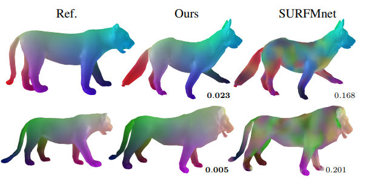

# SURFMNet-Multispectral

Source code for the paper "Unsupervised Scale-Invariant Multispectral Shape Matching" by Idan Pazi, Dvir Ginzburg and Dan Raviv.  
Based on the source code of [SURFMNet](https://github.com/LIX-shape-analysis/SURFMNet).

### Shape Matching

To train a model

        python train_DFMnet.py

To obtain matches after training for a given set of shapes:

        python test_DFMnet.py
        
